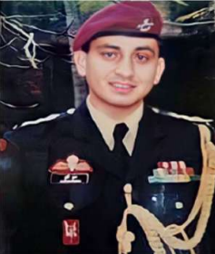
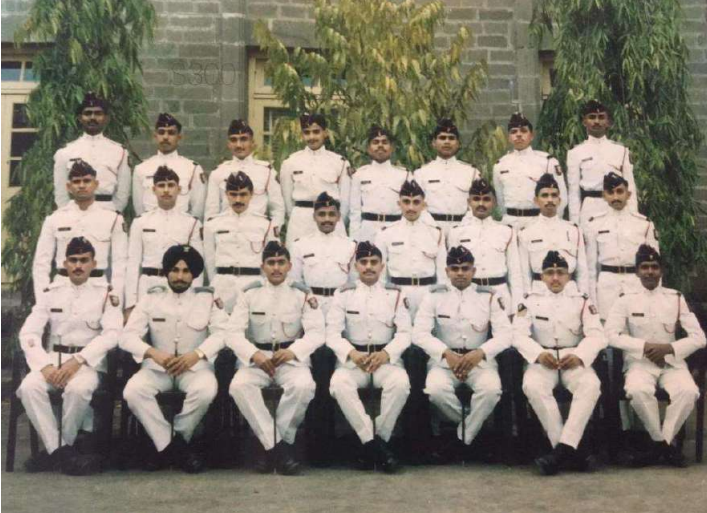
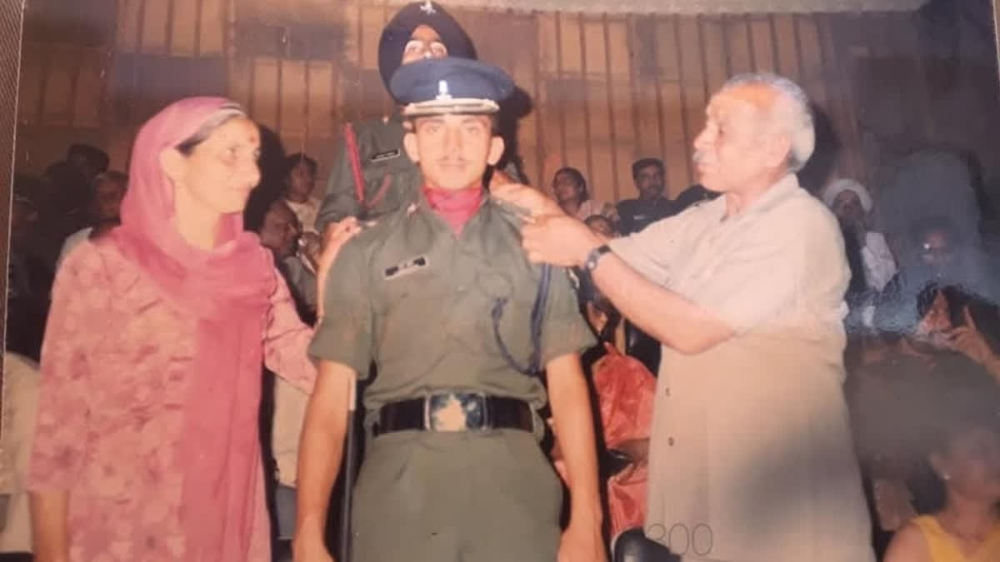
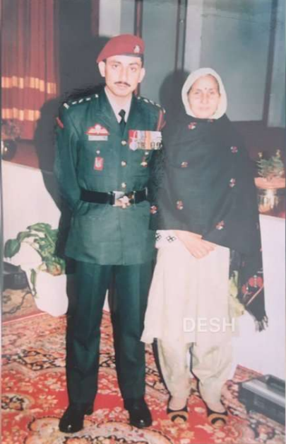
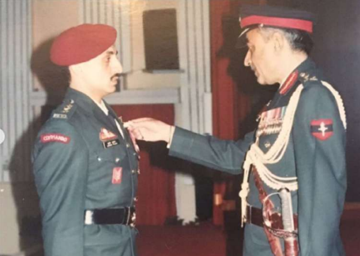
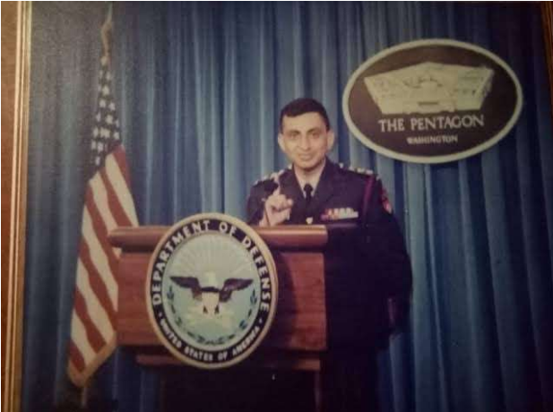
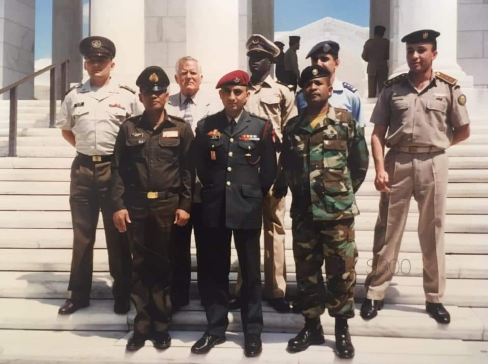
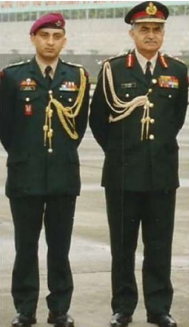
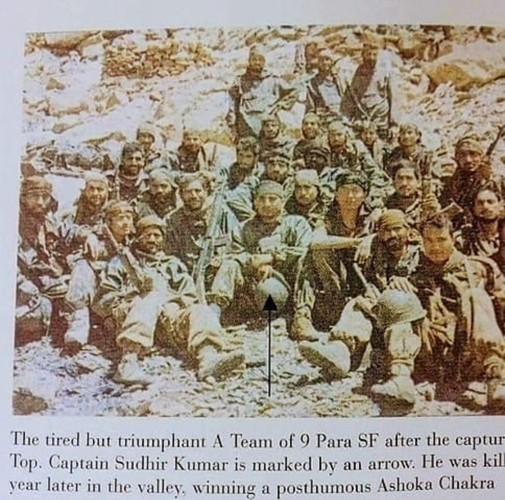
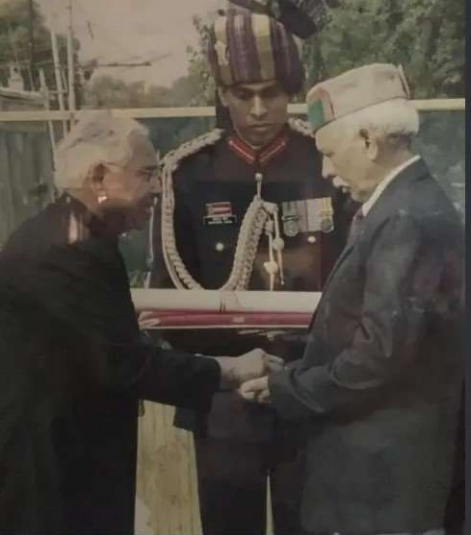

# Major Sudhir Kumar, AC, SM* : The Rambo of the Indian Army

*Major Sudhir Kumar, AC, SM** *

Major Sudhir Kumar, AC, SM & Bar was born on 24th May, 1969 in a military hospital in Jodhpur to Subedar Major Rulia Ram and Mrs Rajeswari Devi. His family natively belonged to a village named Banuri in the Kangra district of Himachal Pradesh. Major Sudhir Kumar grew up watching his father serve in the army and he naturally grew an affection towards the Olive Green uniform. This affection for the uniform was turned into firm resolve to wear it at Sainik School, Sujanpur Tihra. After completing school, he went by the book to become an army officer by joining the 72nd course at the National Defence Academy in 1984 at the age of 16. Thereafter he underwent three years of gruelling training at the National Defence Academy which turned the young boy into a man capable of leading men into battles.

*Major Sudhir Kumar at the National Defence Academy.*

After passing out from NDA, he joined the Indian Military Academy for the final year of his training where he was polished into a gentleman, a scholar, a warrior and a leader, all the qualities required to produce an officer worthy of joining the army. After four years of military training, on 11th June, 1988 he was commissioned as a Second Lieutenant into the 4th Battalion of the Jat Regiment at the age of 20.

*2nd Lt Sudhir Kumar's pipping ceremony at the Indian Military Academy*

Shortly after his commissioning, Major Sudhir Kumar's battalion, 4 Jat, moved to Sri Lanka as part of the Indian Peace Keeping Force, IPKF. The IPKF was sent under the Indo-Sri Lanka Accord to end the Sri Lankan Civil War between the Sri Lankan Tamil militant groups and the Sri Lankan Government.

After coming back from Sri Lanka, he was promoted as a Lieutenant on 11th June 1990. Major Sudhir Kumar then opted for special forces. Thereafter he underwent a three month brutal probationary period in the special forces where his physical and mental strengths were tested to the very limits of human capabilities. Some might argue that the special forces tests officers, JCOs and NCOs a few steps beyond the human limits of physical and mental toughness. In 1990, after clearing the probation with flying colours, Major Sudhir Kumar joined the 9th Battalion of the Parachute Regiment (Special Forces), a special forces unit that specialises in high altitude and mountain terrain operations, unconventional warfare, covert operations, counter-terrorist and counter-insurgency operations. He went through the commando course at the Commando School in Belgaum, Karnataka, a jungle warfare course at the Counter Insurgency and Jungle Warfare School (CIJWS) in Vairengte, Mizoram, and a mountain warfare course at the High Altitude Warfare School (HAWS) in Gulmarg, Jammu and Kashmir. Major Sudhir Kumar also served two six-month terms at the Siachen Glacier.

*Captain Sudhir Kumar with his mother Mrs Rajeswari Devi*

He was promoted as a Captain on 11th June 1993. In July 1993, in an operation in Kandi village, located in Budhal tehsil of Rajouri district, Major Sudhir Kumar eliminated three terrorists. He was awarded the Sena Medal (gallantry) on 26th January 1994 for his commendable courage, leadership and devotion to duty during this operation. Major Sudhir Kumar was decorated with a 'Bar' to the Sena Medal for being part of an expedition to scale the peak Brammah II in the Brammah mountains in the Kishtwar region of Jammu and Kashmir in September 1994. It was an armed mountaineering expedition carried out with full battle load, where the purpose was training in extremely challenging conditions.
Major Sudhir Kumar was given the name "Rambo" by his fellow officers and the JCOs and NCOs he commanded due to his exceptional bravery.

*Captain Sudhir Kumar being decorated with Sena Medal (Gallantry)*

In 1997, Major Sudhir Kumar was sent to the United States of America by the army to attend a specialised six-month course about unconventional warfare and covert operations. He was ranked first in the order of merit in the course which was attended by the finest officers from 80 countries. Because of his exceptional competence, he was given the name "Colonel" by his international colleagues. Following his extraordinary performance in the course, Major Sudhir Kumar, then Captain Sudhir Kumar, was invited to The Pentagon, the headquarters of the United States Department of Defence, to address the members of the U.S. Special Operations Forces (SOF). After he finished delivering his speech, the entire room stood up in applause. The standing ovation lasted for a full five minutes, a remarkably rare and prestigious honour for any officer.

*Addressing the U.S. Special Operations Forces at The Pentagon.*

*With fellow officers from across the world.*

After returning from the United States, Major Sudhir Kumar was appointed as the Aide-de-Camp (ADC) to the then Chief of the Army Staff (COAS), General Ved Prakash Malik. In 1998, while serving as the ADC to the COAS, Gen V.P. Malik, he was promoted to the rank of Major.

*With General Ved Prakash Malik, then Chief of the Army Staff.*

On 3rd May 1999, the Kargil War broke out when local shepherds first reported Pakistani intrusions in the Batalik Sector. Major Sudhir Kumar's unit, 9 PARA, was moved to the frontline in active combat role while he was still serving as the ADC to the COAS in New Delhi. Major Sudhir Kumar requested General V.P. Malik to relieve him of his staff posting in New Delhi despite the fact that he was still recovering from a prior military service-induced injury. He was granted special permission from the COAS to join his unit on the frontline in mid-July 1999.

On 22nd July 1999, just four days prior to the official declaration of India's total victory in the Kargil War (26th July 1999), the Battle of Zulu Top unfolded. The Zulu Top is located in the Mushkoh Valley, which is in the westernmost part of Ladakh near the Line of Control. The valley floor lies at about 3400 meters and the Zulu Top is about 5200 meters (approximately 17000 feet) high. This glaciated terrain consists of four interconnected geographical features that form a continuous vertical ridge. The Zulu Base is the low-lying glacial ground at the bottom of the ridge, leading up to the Thumb, an intermediate thumb-shaped rock formation. Higher up lies the Tri Junction, an intersecting choke point where three distinct mountain spurs converge, all culminating at Zulu Top, the peak that dominates the surrounding regions.

The assault began on 22nd July when troops from the C Company of the 3rd Battalion of the 3rd Gorkha Rifles (3/3 GR) led by Captain Hemang Gurung climbed the mountain, clearing the first three features which included the Zulu Base, the Thumb and the Tri Junction. The Pakistani troops from the 19 Battalion of the Frontier Force Regiment (19 FF) retreated upwards to the Zulu Top. The Pakistanis had consolidated heavy fire power to defend the Zulu Top and hence 9 PARA was assigned with the task of capturing the Zulu Top.

On 25th July 1999, Major Sudhir Kumar led a team of special forces operators from 9 PARA up the Zulu Top. He was supported in the assault by another team of 9 PARA led by Major Dhaliwal and two platoons of C Company of the 3/3 GR led by Captain Amit Aul. In the assault 9 PARA suffered four casualties and the 19 FF suffered thirteen casualties, and the remaining Pakistanis fled back across the LoC. On being asked about his attack on Zulu Top without needing to acclimatise, Major Sudhir Kumar famously said, "Sir, you know that I'm a pahari (from the mountains). I don't need acclimatisation."

*Major Sudhir Kumar on Zulu Top with his team.*

After the decisive Indian victory in the Kargil War, 9 PARA was moved back to counter-terrorism roles in Jammu and Kashmir.

On 29th August 1999 at 0830 hours IST, Major Sudhir Kumar led a squad of five men into the dense Haphruda forest in Kupwara District of Jammu and Kashmir. Soon he heard voices of militants but was unable to see them. He, along with his buddy, crawled uphill and on reaching a knoll, observed two armed militants barely four metres ahead, and a large covered hideout in a depression 15 metres below. The officer immediately fired, killing the closest sentry and charged at the second, who jumped back towards the hideout. Major Sudhir Kumar, without hesitation, charged at the hideout with only his buddy giving him covering fire. The militants, who outnumbered about twenty, were shocked and rushed out in an attempt to flee. The officer single-handedly grappled with them and, firing from a distance of two metres, killed four militants. In this action, however, he was hit on his face, chest and arm and fell down bleeding profusely at the entrance to the hideout. Major Sudhir Kumar, although unable to move, called up his troop commanders and all the stops on the radio set and directed them to hold fast and not to allow the rest of the militants to escape. It was only after 35 minutes, when the fire fight stopped, that he permitted his evacuation. Bleeding profusely, he continued to pass instructions to his troops on his radio set. He passed away holding his set. Major Sudhir Kumar thus displayed most conspicuous gallantry and bravery beyond compare and made the supreme sacrifice in the highest traditions of the Indian Army.

*Subedar Major Rulia Ram receives the Ashok Chakra awarded posthumously to his son.*

